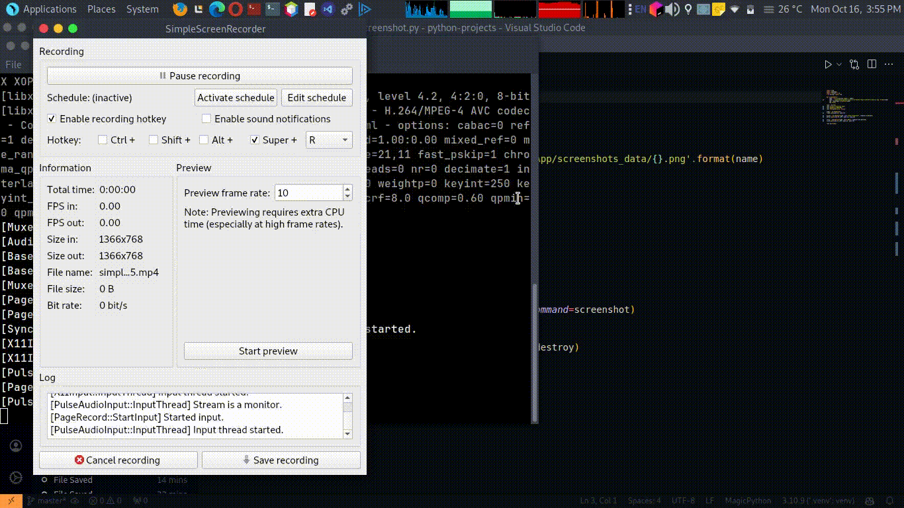

**README.md**

**Screenshot App**

**🎉** This is a simple Python app that takes screenshots of your screen.

**How to use it**

1. Run the app.
2. Click the "Take Screenshot" button.
3. A screenshot of your screen will be saved to the `screenshots_data` directory.
4. The screenshot will also be displayed in a new window.

**Features**

* Easy to use
* Lightweight
* Cross-platform

**Dependencies**

* Python 3.6+
* PyAutoGUI
* Tkinter

**License**

This app is licensed under the GNU License.

**Animation**

[]


**Example usage**

```markdown
Here is an example of how to use the Screenshot App:

1. Run the app.
2. Click the "Take Screenshot" button.
3. A screenshot of your screen will be saved to the `screenshots_data` directory.
4. The screenshot will also be displayed in a new window.
```

**Conclusion**

The Screenshot App is a simple and easy-to-use app for taking screenshots. It is lightweight and cross-platform, making it a good choice for users of all operating systems.
